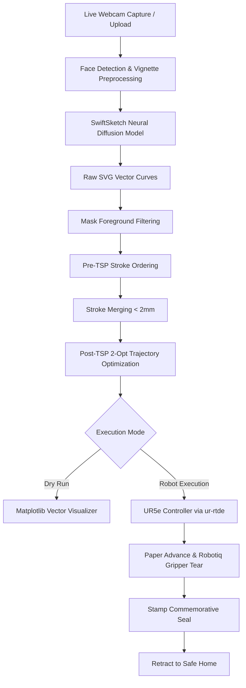

# The Portraitron 3000 🎨🤖

[](https://www.python.org/downloads/)
[](https://www.universal-robots.com/)
[](https://pytorch.org/)
[](https://fastapi.tiangolo.com/)

> An end-to-end autonomous robotic artist system that captures portrait photos, translates them into optimized vector paths using generative AI diffusion models, and physically draws them with a UR5e robotic arm with automated paper manipulation.

---

## 📌 Table of Contents

- [Project Overview](#-project-overview)
- [System Pipeline Architecture](#-system-pipeline-architecture)
- [Repository Structure](#-repository-structure)
- [Tech Stack & Environments](#-tech-stack--environments)
- [SwiftSketch Setup & Pretrained Checkpoints](#-swiftsketch-setup--pretrained-checkpoints)
- [Configuration Guide](#-configuration-guide)
- [Execution & CLI Usage](#-execution--cli-usage)
  - [Interactive Menu](#interactive-menu)
  - [One-Shot CLI Modes](#one-shot-cli-modes)
  - [Advanced Optimization & Safety Flags](#advanced-optimization--safety-flags)
- [Web Control Dashboards](#-web-control-dashboards)
  - [1. FastAPI Server & Kiosk Interface](#1-fastapi-server--kiosk-interface)
  - [2. Interactive Web Command Dashboard](#2-interactive-web-command-dashboard)
- [Scripts & Hardware Utilities](#-scripts--hardware-utilities)
- [Testing & Quality Assurance](#-testing--quality-assurance)

---

## 📌 Project Overview

**The Portraitron 3000** is an automated cyber-physical portrait artist. It bridges generative computer vision and industrial robotics:

1. **Subject Capture & Preprocessing:** Captures live portrait images via webcam or local upload, performs automatic face detection, crops the subject, and applies edge vignetting / background masking.
2. **Stroke Generation (SwiftSketch Diffusion):** Translates the raster portrait into vector strokes using the **SwiftSketch** diffusion model.
3. **Noise Filtering & Stroke Merging:** Removes background noise using foreground binary masks and joins proximate stroke endpoints to minimize unnecessary pen lifts.
4. **Path Optimization (TSP):** Formulates trajectory ordering as a Double-Ended Traveling Salesperson Problem (TSP) with 2-opt local search heuristics, reducing airborne transition travel distance by over 80%.
5. **Robotic Drawing Execution:** Drives a **UR5e** robotic arm via `ur-rtde` using Cartesian compliance control and blend radius kinematics.
6. **Automated Paper Swapping & Branding:** Manages paper advancement via a motorized roller / Robotiq 2F-85 gripper, applies a commemorative stamp mark, and returns safely to home position.

---

## 📐 System Pipeline Architecture



---

## 📁 Repository Structure

```text
The Protraitron/
├── config/                         # YAML configuration files
│   ├── files_pathes.yaml           # Global file path registry
│   ├── marker.yaml                 # Drawing kinematics, speeds, & tool heights
│   ├── paper_manipulation.yaml     # Paper roll & gripper coordinate profiles
│   ├── robot_logic.yaml            # Drawing defaults & algorithm thresholds
│   ├── server.yaml                 # Network IPs, ports, & server credentials
│   └── vision.yaml                 # Camera indices, crop ratios, & detection settings
├── docs/                           # System guides & hardware manuals
│   ├── scripts/                    # Documentation for peripheral scripts
│   ├── network_setup.md            # Static IP & subnet configuration
│   ├── PolyScopeX_Connection_Guide.md # Universal Robots PolyScope setup
│   └── agent_workflow.md           # Autonomous agent guidelines
├── scripts/                        # Calibration, diagnostics, and testing scripts
│   ├── calibrate_paper_gui.py      # Tkinter GUI for paper swap position tuning
│   ├── calibrate_workspace.py      # Force-probing drawing plane calibration
│   ├── go_to_ymal_location.py      # UR5e motion diagnostic to YAML positions
│   ├── record_location_to_ymal.py  # Interactive end-effector position recorder
│   ├── send_notification.py        # Push notification service integration
│   └── test_ur5e_connection.py     # Network ping & RTDE socket health check
├── src/                            # Core application source code
│   ├── common/                     # Shared utilities & logging
│   │   ├── logger.py               # Centralized logger
│   │   └── robot_utils.py          # Math, coordinate transforms, & geometry
│   ├── robot/                      # Robot motion & drawing pipeline
│   │   ├── controller.py           # UR5e RTDE controller & compliance control
│   │   ├── mask_filtering.py       # SVG background pruning via binary mask
│   │   ├── paper_handler.py        # Automated paper roll & swap sequencing
│   │   ├── paper_roller.py         # Motorized roller driver
│   │   ├── path_optimization.py    # TSP 2-opt solver & stroke merging
│   │   ├── poc_drawing.py          # Geometric POC (circles/chords) drawing
│   │   ├── robotiq_gripper.py      # Robotiq 2F-85 gripper interface
│   │   ├── svg_drawing.py          # SVG parser & Cartesian path normalizer
│   │   ├── swiftsketch_integration.py # SwiftSketch inference subprocess wrapper
│   │   └── text_drawing.py         # Hershey vector font text rendering
│   ├── server/                     # FastAPI backend & web assets
│   │   ├── main.py                 # FastAPI application server
│   │   └── static/                 # Frontend client (HTML, CSS, JS)
│   └── vision/                     # Vision capture & image processing
│       └── camera_capture.py       # OpenCV camera feed, face crop, & vignetting
├── tests/                          # Automated unit test suite
├── command_generator_server.py     # Interactive Web Command Dashboard (port 8080)
├── command_generator.html          # Web Command Dashboard UI
├── main.py                         # Main CLI entrypoint & orchestrator
└── requirements.txt                # Python package dependencies
```

---

## 💻 Tech Stack & Environments

To prevent dependency conflicts between real-time robot control libraries and heavy PyTorch neural dependencies, the system uses two decoupled Python environments:

### 1. Robot Control & Core Environment (`./venv`)
Drives the UR5e robot, calibration tools, vision capture, and FastAPI server.
* **Python:** 3.9+
* **Key Dependencies:** `ur-rtde`, `opencv-python`, `fastapi`, `uvicorn`, `matplotlib`, `pyyaml`, `pillow`, `python-multipart`
* **Installation:**
  ```bash
  python3 -m venv venv
  source venv/bin/activate
  pip install --upgrade pip
  pip install -r requirements.txt
  ```

### 2. AI Sketching Environment (`swiftsketch_env` Conda)
Runs the SwiftSketch diffusion model and differentiable vector rasterizer (`pydiffvg`).
* **Python:** 3.9.19 (Conda)
* **Hardware Acceleration:** Native Apple Silicon MPS (Metal Performance Shaders) & NVIDIA CUDA. Generates 50 diffusion steps in **~1 second** on Apple Silicon (accelerated from ~2 minutes on CPU).
* **Dependencies:** `torch==2.3.1`, `torchvision==0.18.1`, `pydiffvg`, `clip`

---

## ⚙️ SwiftSketch Setup & Pretrained Checkpoints

### 1. Clone SwiftSketch
Clone the SwiftSketch repository alongside the main project directory (or use the included submodule):
```bash
# Option A: Side-by-side clone
cd ..
git clone https://github.com/swiftsketch/swiftsketch.git
cd The-Protraitron

# Option B: Initialize git submodule
git submodule update --init --recursive
```

### 2. Set Up the Conda Environment
```bash
conda create -n swiftsketch_env python=3.9.19 -y
conda activate swiftsketch_env
pip install torch==2.3.1 torchvision==0.18.1 torchaudio==2.3.1
pip install -r ../swiftsketch/requirements.txt
pip install git+https://github.com/openai/CLIP.git
```

### 3. Download Pre-trained Checkpoints
Download the official model weights and place them under `swiftsketch/SwiftSketch/save/`:
* [sketch-diffusion checkpoint](https://drive.google.com/uc?export=download&id=19FryO99dCmz-Dw1jzeZITUI0uuksiOA-)
* [refinement-network checkpoint](https://drive.google.com/uc?export=download&id=1OrLzwaJXZ4SlDw3hqn71Yg1L01ytLv2x)

Expected directory layout:
```text
swiftsketch/SwiftSketch/save/
├── sketch-diffusion/
│   ├── args.json
│   └── model000450000.pt
└── refinement-network/
    ├── args.json
    └── model000430000.pt
```

---

## 🔧 Configuration Guide

All configuration files reside in [`config/`](config/):

| Configuration File | Primary Purpose | Key Fields |
| :--- | :--- | :--- |
| **`files_pathes.yaml`** | File path registry | Mapping to calibration, logic, marker, and server YAMLs. |
| **`marker.yaml`** | Drawing & tool dynamics | Velocity, acceleration, blend radius, Z-lift height, force thresholds, SwiftSketch inference options. |
| **`paper_manipulation.yaml`** | Paper roll & swap poses | Grip coordinates, roll durations, tear trajectories, and safety approach offsets. |
| **`robot_logic.yaml`** | Core drawing parameters | Default POC radius, text defaults, SVG canvas scale, mask comparison ratios. |
| **`server.yaml`** | Network & API settings | Robot IP (`192.168.57.101`), Robotiq port (`63352`), server port (`8000`), secret handshake. |
| **`vision.yaml`** | Image capture & face detection | Camera device index, crop margins, vignette radius, and blur kernel size. |

---

## 🚀 Execution & CLI Usage

The primary orchestrator is [main.py](main.py).

### Interactive Menu

Launch the interactive console menu:
```bash
./venv/bin/python main.py
```

The system presents the following interactive options:
```text
==================================================
PORTRAITRON 3000 - MAIN CONTROL INTERFACE
==================================================
1. POC (Semicircle & Diameter)
2. Write Custom Text
3. Draw SVG file
4. Sketch & Draw Portrait (SwiftSketch)
5. Capture Photo from Webcam & Sketch
6. Batch Draw with Paper Swap (SVG)
7. Start Web Dashboard Server
==================================================
```

---

### One-Shot CLI Modes

Bypass the interactive menu using command-line arguments:

#### 1. Proof of Concept (POC) Drawing
Draws a calibrated geometric semicircle and chord to verify Cartesian kinematics:
```bash
./venv/bin/python main.py --POC left --radius 5.0 --angle 180.0
```

#### 2. Vector Text Writing
Draws text characters using Hershey vector fonts:
```bash
./venv/bin/python main.py --text "Portraitron 3000"
```

#### 3. SVG Vector File Drawing
Parses, optimizes, and executes any arbitrary SVG path:
```bash
./venv/bin/python main.py --svg plots/sample.svg
```

#### 4. SwiftSketch Portrait Generation & Drawing
Runs neural sketch diffusion on an input portrait image, optimizes the strokes, and draws the output:
```bash
./venv/bin/python main.py --sketch pictures/portrait.jpg
```

#### 5. Live Webcam Capture & Sketch
Captures a frame from the webcam, crops the face, blends the background, generates vector strokes, and draws:
```bash
./venv/bin/python main.py --capture
```

#### 6. Batch Drawing with Automated Paper Swap
Draws the SVG and triggers the physical gripper & paper-roll swapping sequence upon completion:
```bash
./venv/bin/python main.py --svg plots/sample.svg --paper-swap
```

---

### Advanced Optimization & Safety Flags

| Flag | Type | Default | Description |
| :--- | :--- | :--- | :--- |
| **`--dryrun`** / **`-d`** | Flag | `False` | Simulates the drawing in a Matplotlib window without connecting to the robot. |
| **`--optimize`** | Flag | `True` | Enables pre-TSP ordering, stroke merging, and 2-opt TSP path optimization. |
| **`--no-optimize`** | Flag | `False` | Disables stroke optimization. |
| **`--merge-threshold`** | Float | `0.002` | Distance threshold in meters (2.0 mm) for merging adjacent stroke endpoints into continuous chains. |
| **`--mask`** | String | `None` | Path to a binary foreground mask PNG to filter out background noise strokes. |
| **`--mask-keep-ratio`** | Float | `0.7` | Minimum fraction of stroke points required to fall inside foreground mask pixels. |
| **`--approve`** | Flag | `False` | Displays the drawing preview plot and requires terminal confirmation before physical robot motion begins. |
| **`--paper-swap`** | Flag | `False` | Triggers the robotic paper roll and tear routine after drawing finishes. |
| **`--server`** / **`-S`** | Flag | `False` | Boots the FastAPI web server directly. |

> [!TIP]
> **Headless Execution (Dry Run):**  
> In background or remote sessions without an active display server, prepend `MPLBACKEND=Agg`:
> ```bash
> MPLBACKEND=Agg ./venv/bin/python main.py --dryrun --sketch pictures/portrait.jpg
> ```

---

## 🎛️ Web Control Dashboards

The Portraitron includes two complementary web interfaces:

### 1. FastAPI Server & Kiosk Interface

A full-featured web client designed for kiosk deployments and live events.

```bash
./venv/bin/python src/server/main.py
# or
./venv/bin/python main.py --server
```
- **URL:** `http://localhost:8000` (or local network IP)
- **Features:**
  - **Live Camera Capture:** Stream video from local network devices, frame subjects using on-screen guides, and capture directly.
  - **Drag-and-Drop Upload:** Upload images directly from desktop or mobile devices.
  - **Live Drawing Telemetry:** Real-time progress bar, coordinates, and stroke index tracking.
  - **Passcode Authentication:** Prevents accidental or unauthorized robot execution (`portraitron`).

---

### 2. Interactive Web Command Dashboard

A lightweight, multi-threaded control server for visual parameter tuning and real-time execution monitoring.

```bash
./venv/bin/python command_generator_server.py
```
- **URL:** `http://localhost:8080`
- **Features:**
  - **Interactive Sliders:** Visually adjust **Mask Keep Ratio** (0.50 – 0.95) and **Merge Threshold** (0.0 – 5.0 mm).
  - **Real-Time CLI Generator:** Automatically generates the exact terminal command based on active toggles.
  - **Live Console Log Stream:** Executes processes asynchronously and streams standard stdout/stderr logs directly into an in-browser console.
  - **Emergency Abort:** Instantly kill running drawing operations with a single click.

---

## 🛠️ Scripts & Hardware Utilities

The repository contains dedicated calibration, diagnostic, and communication tools in [`scripts/`](scripts/):

| Script | Documentation | Description |
| :--- | :--- | :--- |
| [`scripts/calibrate_paper_gui.py`](scripts/calibrate_paper_gui.py) | [Paper Calibration GUI](docs/scripts/calibrate_paper_gui.md) | Interactive Tkinter GUI for jogging the UR5e and fine-tuning gripper grasp and paper tear coordinates. |
| [`scripts/calibrate_workspace.py`](scripts/calibrate_workspace.py) | [Workspace Calibration](docs/scripts/calibrate_workspace.md) | Uses compliant force probing to detect the drawing plane and establish 3D canvas coordinate boundaries. |
| [`scripts/go_to_ymal_location.py`](scripts/go_to_ymal_location.py) | [Go-to YAML Position](docs/scripts/go_to_ymal_location.md) | Moves the UR5e directly to named waypoint positions stored in configuration YAMLs. |
| [`scripts/record_location_to_ymal.py`](scripts/record_location_to_ymal.py) | [Record Position to YAML](docs/scripts/record_location_to_ymal.md) | Reads the current end-effector Cartesian pose and writes it to configuration files. |
| [`scripts/send_notification.py`](scripts/send_notification.py) | [Push Notifications](docs/scripts/send_notification.md) | Sends push notifications and alerts regarding drawing status or system errors. |
| [`scripts/test_ur5e_connection.py`](scripts/test_ur5e_connection.py) | [UR5e Connection Diagnostics](docs/scripts/test_ur5e_connection.md) | Tests network ping, RTDE socket connectivity, and dashboard server responsiveness. |
| [`scripts/roll_paper.py`](scripts/roll_paper.py) | — | Standalone script to drive the motorized paper roller. |
| [`scripts/test_paper_sequences.py`](scripts/test_paper_sequences.py) | — | Executes and verifies paper advancing and cutting sequences. |
| [`scripts/test_ur5e_nudge.py`](scripts/test_ur5e_nudge.py) | — | Cartesian micro-step jogging utility for millimeter-level end-effector positioning. |

### Supplementary Documentation
- [PolyScopeX Connection Guide](docs/PolyScopeX_Connection_Guide.md)
- [Network Setup Guide](docs/network_setup.md)
- [Agent Workflow Guide](docs/agent_workflow.md)

---

## 🧪 Testing & Quality Assurance

Run the automated test suite to verify vector parsing, path optimization algorithms, and masking operations:

```bash
./venv/bin/pytest tests/ -v
```

Test coverage includes:
- **`tests/test_svg_drawing.py`**: SVG parsing, coordinate normalization, and Bézier stroke decomposition.
- **`tests/test_path_optimization.py`**: TSP solver convergence, distance reduction verification, and stroke merging logic.
- **`tests/test_mask_filtering.py`**: Binary mask thresholding and foreground stroke preservation.
- **`tests/test_swiftsketch_integration.py`**: Image preprocessing, aspect ratio padding, and command formulation.

---

## 🛡️ Safety & Operational Guidelines

- **E-Stop Access:** Always keep the hardware Emergency Stop button within reach when running physical robot executions.
- **Dry-Run First:** Always test new SVG files or generated sketches with `--dryrun` or `--approve` to verify trajectories before moving the physical arm.
- **Compliance Force Limits:** The controller enforces software force limits and non-interactive TTY safeguards to prevent mechanical collisions.

---

## 📄 License

This project is licensed under the MIT License. See [LICENSE](LICENSE) for details.
