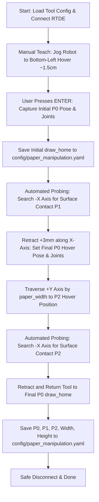

<style>
  body {
    font-family: 'Inter', sans-serif;
  }
  h1, h2, h3, h4 {
    font-family: 'Space Grotesk', sans-serif;
    text-transform: uppercase;
  }
  h1 {
    border-bottom: 3px solid #4a148c;
    padding-bottom: 5px;
  }
  h2 {
    border-bottom: 2px solid #26a69a;
    padding-bottom: 4px;
    margin-top: 1.5em;
  }
  h3 {
    color: #4a148c;
    margin-top: 1.2em;
  }
  pre, code {
    font-family: 'JetBrains Mono', monospace;
  }
  pre {
    background-color: #0f0f10;
    color: #e0e0e0;
    padding: 12px;
    border-radius: 4px;
    overflow-x: auto;
  }
  code {
    background-color: #f4f4f4;
    color: #d32f2f;
    padding: 2px 4px;
    border-radius: 3px;
  }
  pre code {
    background-color: transparent;
    color: inherit;
    padding: 0;
  }
  table {
    border-collapse: collapse;
    width: 100%;
    margin: 1em 0;
  }
  th, td {
    border: 1px solid #ddd;
    padding: 8px 12px;
    text-align: left;
  }
  th {
    background-color: #f5f5f5;
    font-family: 'Space Grotesk', sans-serif;
  }
</style>

# Workspace Calibration Script (`calibrate_workspace.py`)

**File:** `scripts/calibrate_workspace.py`

## Overview

The `calibrate_workspace.py` script is a core calibration utility for the Portraitron 3000 robotic sketching system. It establishes the physical drawing reference frame on the drawing board for a Universal Robots UR5e cobot arm by combining interactive manual teaching with automated, high-precision force-torque sensor probing.

---

## Purpose

To ensure accurate, repeatable drawing strokes without damaging pens or tearing paper, the robot must know the exact position and orientation of the drawing plane. 

`calibrate_workspace.py` accomplishes this by:
1. **Capturing `draw_home` (P0)**: Recording the home hover position and 6-axis joint angles directly above the canvas origin (bottom-left corner with margins).
2. **Probing `P1` (Bottom-Left Surface Contact)**: Executing a force-controlled approach along the surface normal (-X axis) to detect the exact physical paper contact point.
3. **Calibrating Final `P0`**: Setting `draw_home` exactly at the user-defined `hover_distance` (default: 3 mm) above `P1`.
4. **Probing `P2` (Right-Edge Surface Contact)**: Moving laterally across the sheet width (+Y axis) and probing the surface to capture canvas tilt and depth variations.
5. **Persisting Calibration**: Storing the resulting coordinates, joint angles, and canvas dimensions directly into `config/paper_manipulation.yaml`.

---

## How to Use

### Prerequisites
- The UR5e robot is powered on and connected to the local network.
- The drawing tool / marker is mounted in the robot's end effector.
- Drawing paper is secured on the drawing board.
- The Python virtual environment has `ur_rtde` and `pyyaml` installed.

### Basic Execution

Run the script from the repository root. By default, it loads the `marker` profile (`config/marker.yaml`):

```bash
python scripts/calibrate_workspace.py
```

### Specifying a Custom Tool Profile

You can pass a specific tool configuration profile name or an absolute/relative path to a YAML configuration:

```bash
# Using a named config profile from config/<profile>.yaml
python scripts/calibrate_workspace.py marker

# Or providing a direct file path
python scripts/calibrate_workspace.py config/custom_pen.yaml
```

### Step-by-Step Calibration Walkthrough



1. **Jog the Robot**:
   - Use the UR teach pendant (or Freedrive mode) to position the pen tip approximately **1.5 cm above the bottom-left corner** of the paper (accounting for 1 cm margins).
   - Ensure the pen is **strictly perpendicular** to the drawing board.
2. **Capture Initial Hover Pose (`P0`)**:
   - Press <kbd>ENTER</kbd> in the terminal when prompted.
   - The script records the current TCP pose and joint positions.
3. **Automated Surface Probing (`P1`)**:
   - The script zeroes the FT sensor and commands the robot downward along the -X axis until the force threshold is triggered and verified.
   - The verified contact coordinates are recorded as `p1`.
4. **Final `P0` Hover Establishment**:
   - The robot retracts +3 mm along the X axis from `P1` and logs the final `draw_home` pose and joint state.
5. **Lateral Traversal & Secondary Probing (`P2`)**:
   - The arm moves laterally along the +Y axis by `paper_width`.
   - The robot performs a second force probe to find `p2` on the right side of the canvas.
   - Upon confirmation, the robot retracts and returns safely to `P0` (`draw_home`).
6. **Save & Exit**:
   - All results are serialized to `config/paper_manipulation.yaml`.

---

## Configuration Files

### 1. Input Configuration (`config/[config_name].yaml`)

The script reads operational parameters from the selected tool YAML file (e.g., `config/marker.yaml`):

| Parameter | Type | Default | Description |
| :--- | :--- | :--- | :--- |
| `robot_ip` | `string` | `"192.168.57.100"` | IP address of the UR5e robot controller. |
| `paper_width` | `float` | `0.19` | Width of the active drawing area (meters). |
| `paper_height` | `float` | `0.27` | Height of the active drawing area (meters). |
| `hover_distance` | `float` | `0.003` | Safety retraction distance above the paper (meters, e.g. 3 mm). |
| `move_speed` | `float` | `0.05` | Linear speed for transit motions (m/s). |
| `move_accel` | `float` | `0.1` | Linear acceleration for transit motions (m/s²). |

#### Force-Torque Probing Parameters (Nested in Tool YAML)
* **`approach.search_distance`**: Maximum travel distance along -X during probing (e.g., `0.15` m).
* **`approach.initial_approach_speed`**: Linear probing velocity (e.g., `0.005` m/s = 5 mm/s).
* **`approach.force_threshold`**: Contact detection force trigger (e.g., `0.9` N).
* **`verification.force_verification`**: Minimum force reading to confirm contact stability.
* **`calibration.sensor_zero_sleep`**: Settling duration after calling `zeroFtSensor()`.

---

### 2. Output Configuration (`config/paper_manipulation.yaml`)

The calibration results are saved into `config/paper_manipulation.yaml`, updating or creating the following keys while preserving all other existing entries (such as tool docks, magnet waypoints, and speed profiles):

```yaml
locations:
  draw_home: [-0.4277, 0.0906, 0.1521, 0.0325, -1.5950, -0.0316] # 6D TCP pose [X, Y, Z, Rx, Ry, Rz]
p0_joints: [3.2724, -1.7902, -2.3182, -2.1987, -1.4399, -4.7514] # 6-axis joint angles (radians)
p1: [-0.4307, 0.0906, 0.1521, 0.0325, -1.5950, -0.0316]        # Surface contact at bottom-left corner
p2: [-0.4302, 0.4906, 0.1523, 0.0325, -1.5950, -0.0316]        # Surface contact at bottom-right / width offset
width: 0.19                                                      # Canvas width (meters)
height: 0.27                                                     # Canvas height (meters)
```

---

## Inner Workings & Technical Architecture

### 1. Dual RTDE Interface Connection
The script opens low-latency Ethernet sockets with the UR5e controller via `ur_rtde`:
- **`RTDEControlInterface`** (Port 30003): Dispatches real-time motion commands (`moveL`, `zeroFtSensor`, `stopL`).
- **`RTDEReceiveInterface`** (Port 30004): Streams real-time telemetry at up to 500 Hz (`getActualTCPPose`, `getActualQ`, `getActualTCPForce`).

### 2. Robust Force Feedback Surface Probing (`probe_surface_point`)
The automated probing routine (`src.common.robot_utils.probe_surface_point`) operates in two sequential phases:
1. **Phase 1: Dynamic Contact Search**:
   - Zeroes the internal F/T sensor to eliminate drift.
   - Moves the TCP along the robot base -X axis at `initial_approach_speed`.
   - Polls `getActualTCPForce()` every 10 ms. If the net force along the X-axis exceeds `force_threshold`, it immediately commands `stopL()`.
2. **Phase 2: Contact Verification**:
   - Samples multiple consecutive force readings. If the contact is verified as stable, the exact TCP pose is captured.
   - If false contact or transient vibration is detected, it reduces approach speed and resumes probing.

### 3. Coordinate Frame Conventions
- **X-axis**: Normal to the vertical drawing surface (negative X moves toward the board; positive X moves away/retracts).
- **Y-axis**: Horizontal along the width of the canvas (left to right).
- **Z-axis**: Vertical along the height of the canvas (bottom to top).

---

## Safety Mechanisms & Error Handling

- **Probing Timeout**: A hard 30-second safety timeout prevents infinite motion loops if no contact is detected.
- **Search Distance Bound**: Probing automatically halts if travel exceeds `search_distance`.
- **Protective Stop Prevention**: Slow approach speeds (5 mm/s) and rapid deceleration (`stop_deceleration = 2.0`) prevent hard impacts that could trigger robot controller protective stops or bend pen nibs.
- **Clean Socket Teardown**: Sockets for both control and receive channels are closed within a `finally` block to prevent port locking on subsequent runs.
